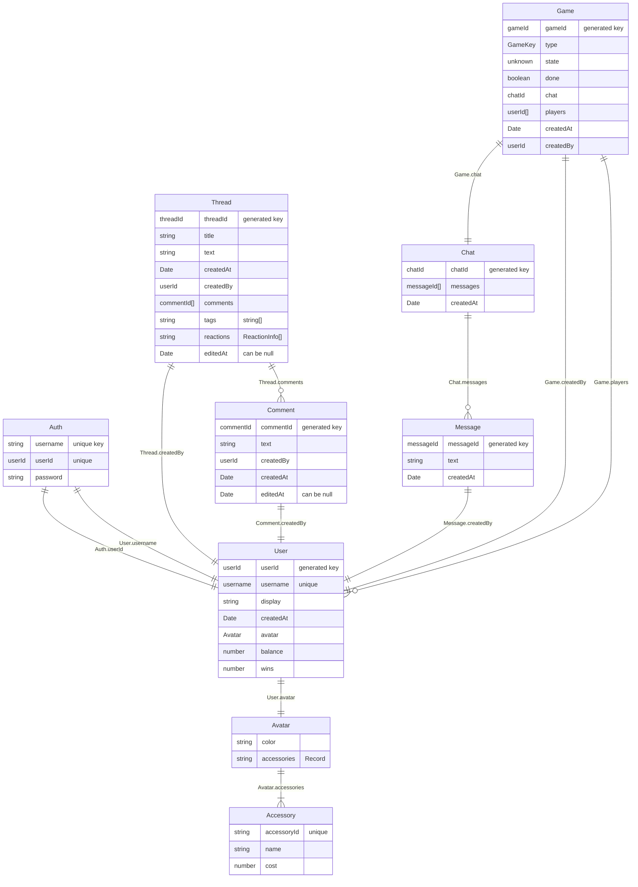

# GameGalaxy

## Overview
GameGalaxy is our semester-long project for CS4530 Software Engineering. We were provided a stripped base to work from, worked with course staff to determine our 3 user stories, as well as 10+ conditions of satisfaction for each. The core purpose of this class was to simulate an agile team working environment across three sprints, organized with Jira.  

GameGalaxy itself is a site with multiplayer correspondence minigames with spectators, paired with community-focused features like forums, avatars, accessories, and shared lobby navigation. Correspondence games are remote matches where participants may take extended time to make their move, from hours to several days.    

## Tech Stack
Typescript  
React  
Websockets  
REST API  
MongoDB  
Playwright & Vitest  

## Live Site/Demo
Site: https://summer26-project-group-107.onrender.com/  
May take ~30s to load on first visit due to Render free plan limitations.  

<table>
  <tr>
    <td align="center" valign="top" colspan="2">
       
      <b>Lobby</b>
    </td>
  </tr>
  <tr>
    <td align="center" valign="top" width="50%">
       
      <b>Avatars</b>
    </td>
    <td align="center" valign="top" width="50%">
       
      <b>Notifications</b>
    </td>
  </tr>
  <tr>
    <td align="center" valign="top" colspan="2">
       
      <b>Auction</b>
    </td>
  </tr>
  <tr>
    <td align="center" valign="top" colspan="2">
       
      <b>Forum</b>
    </td>
  </tr>
  <tr>
    <td align="center" valign="top" colspan="2">
       
      <b>Mahjong</b>
    </td>
  </tr>
</table>

## Process
We created an initial proposal with our user stories and the conditions of satisfaction they would cover, as well as our sprint plans. After each sprint, we would collaborate on a retrospective to understand our successes and shortcomings and how to improve for the following week and stay on track.  

User story 1: Avatars, accessories, shop, currency, auction, new lobby  
User story 2: Forum tags, filtering and sorting, post editing, reactions, thread subscriptions and notifications  
User story 3: Mahjong with 3 or 4 players   

We reached 91% branch coverage on Vitest, and added many e2e Playwright tests to cover the features we added, particularly the updated lobby navigation system.  

## Running Locally

Run `npm install` in the root directory to install all dependencies for the
`client`, `server`, and `shared` folders.  

To run locally in development mode, do one of the following:

1. Run `npm run dev` in the top-level directory
2. Open two terminal windows
   - In the first, navigate to the `server` directory and run `npm run dev`
   - In the second, navigate to the `client` directory and also run
     `npm run dev`

The second terminal window, the one in the `client` directory, shows a URL
that you should go to to preview the application, probably
<http://localhost:4530/>. You can use the default username/password
combinations user0/pwd0000, user1/pwd1111, user2/pwd2222, and user3/pwd3333 to
log in.

### Checking the application

Checks can be run on every part of the application at once by running the
following commands from the repository root:

- `npm run check` - Checks all three projects with TypeScript
- `npm run lint` - Checks all three projects with ESLint
- `npm run test` - Runs Vitest tests on all three projects and end-to-end
  Playwright tests

### Building the application

If you want to deploy the application or build it in production mode, running
`npm run build -w=client` in the root of the repository will create the
production build of the client. Then, the server can be started in production
mode by running `npm start -w=server` and accessed by going to
<http://localhost:8000/>.

### Codebase Folder Structure

- `client`: Contains the frontend application code, responsible for the user
  interface and interacting with the backend. This directory includes all
  React components and related assets.
- `server`: Contains the backend application code, handling the logic, APIs,
  and database interactions. It serves requests from the client and processes
  data accordingly.
- `shared`: Contains all shared type definitions that are used by both the
  client and server. This helps maintain consistency and reduces duplication
  of code between the two folders.

### API Routes

The server provides the following REST endpoints: requests are routed to these
endpoints in `server/src/app.ts`.

#### `/api/game`

| Endpoint  | Method | Description                           |
| --------- | ------ | ------------------------------------- |
| `/create` | POST   | Create new game                       |
| `/list`   | GET    | List all games                        |
| `/:id`    | GET    | Get information about a specific game |

#### `/api/thread`

| Endpoint       | Method | Description                       |
| -------------- | ------ | --------------------------------- |
| `/create`      | POST   | Create new forum post             |
| `/list`        | GET    | List all forum posts              |
| `/:id`         | GET    | Get information about a form post |
| `/:id/comment` | POST   | Add a comment to a forum post     |

#### `/api/user`

| Endpoint     | Method | Description                           |
| ------------ | ------ | ------------------------------------- |
| `/list`      | POST   | Get details of a list of users        |
| `/login`     | POST   | Validate username/password entry      |
| `/signup`    | POST   | Create a new user                     |
| `/:username` | POST   | Update user's displayname or password |
| `/:username` | GET    | Get information about a user          |

### Websockets

The Socket.io API for event-driven communication between clients and the
server is detailed in `shared/src/socket.types.ts`.

### Data Architecture

This web application stores information about users, forum posts, and games.
The structure of the data can be described by this diagram:

